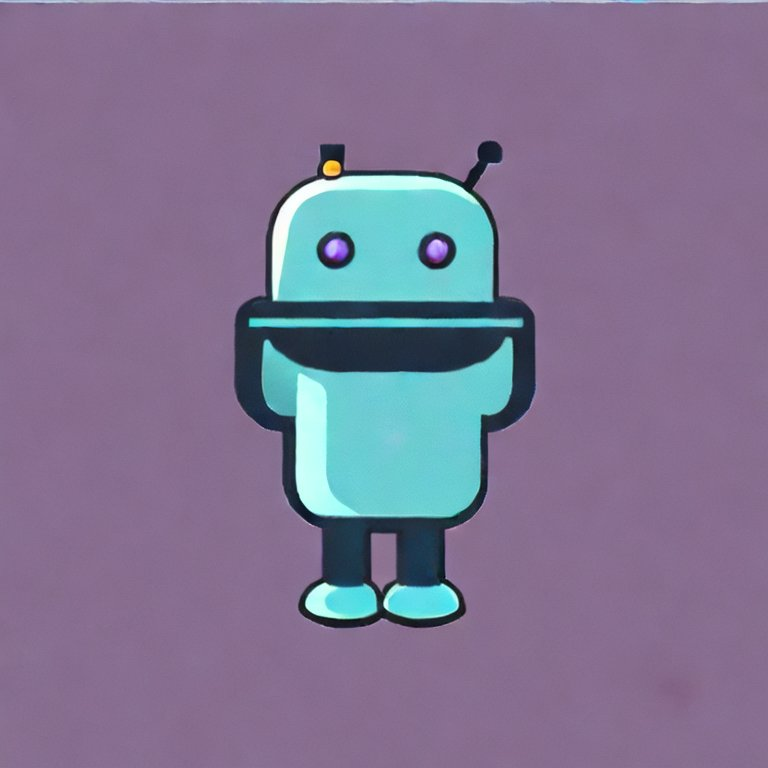

## VoiceCaster
A dynamic Discord bot in Java and Spring Reactor, revolutionizing member engagement through automated activity broadcasts and text-to-speech synthesis for enhanced community communication.
- 
- Tags: Category 1
- Badges:
  - Java, Spring Reactor [blue]
- Buttons:
  - Link [https://example.com]

## InterviewReady360
A versatile Interview Preparation Portal showcasing proficiency in React, Express, Node.js, and MongoDB, featuring diverse functionalities for feedback, blogs, user profiles, quizzes, progress monitoring.
- 
- Tags: Category 2
- Badges:
  - MongoDB, ExpressJs, ReactJS, NodeJS [blue]
- Buttons:
  - Link [https://example.com]

## ASL Digit Detection:
A ResNet inspired CNN model to detect sign language from images.
- 
- Tags: Category 3
- Badges:
  - Python, TensorflowJS, Docker, Heroku [blue]
- Buttons:
  - Link [https://example.com]